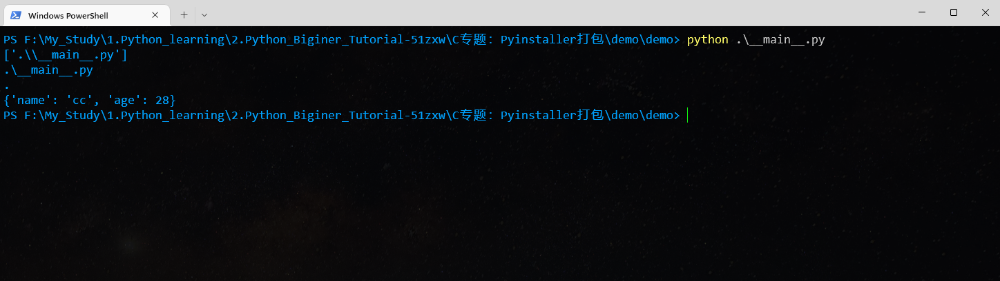

# pyinstaller打包学习笔记


## 一、虚拟环境创建

打包文件最好使用干净的环境去打包，这是对打包效果比较有好处的！


## 二、打包参数

### 1. 多文件打包

#### 1.1 多文件打包命令

```python
pyinstall -D demo.py
```

多文件打包只需要在使用到的文件，使用全局变量先设置BASE_DIR=项目目录，然后文件使用该路径去做拼接即可。


### 2. 单文件打包

#### 2.1 单文件打包命令

```
pyinstall -F demo.py
```


#### 2.2 使用sys.argv获取运行参数

sys.argv是获取用命令行去执行所附带的参数：

```
import json
import os
import sys


def get_dirpath(dpath, num):
    """
    向上获取文件夹路径

    :param dpath: 当前路径
    :param num: 向上获取层数（0层表示当前目录）
    :return: 路径（str）
    """
    back_dir = os.path.dirname(dpath)
    if num >= 1:
        return get_dirpath(back_dir, num - 1)
    else:
        return back_dir


# abs_path = os.path.abspath(__file__)
abs_path = sys.argv
abs_path0 = sys.argv[0]
print(abs_path)
print(abs_path0)
BASE_DIR = get_dirpath(abs_path0, 0)
print(BASE_DIR)

if __name__ == '__main__':
    config_path = os.path.join(BASE_DIR, "res", "config.json")
    with open(config_path, mode="r", encoding="utf-8") as rf:
        data = json.load(rf)
    print(data)
```


例如pycharm运行上面的代码：

 

而使用命令运行上面的py文件：

 

如果附带其他参数：

```
abs_path = sys.argv
abs_path0 = sys.argv[0]
abs_path1 = sys.argv[1]
print(abs_path)
print(abs_path0)
print(abs_path1)
```

 

这样子，我们也学习到了使用参数启动程序的方式了！


#### 2.2 深入了解sys.argv

我们其实在运行exe文件的时候，默认类似使用了”python exe路径"的方式启动，所以第0个参数就是当前启动exe的路径，当然也可以手动更改或是添加其他参数。


#### 2.3 另外一种方式

```
if getattr(sys, 'frozen ', False):
	BASE_DIR = os.path. dirname(sys.executable)else:
BASE_DIR = os.path.dirname(os.path.abspath(__file__))

```


## 三、.spec文件配置

.spec文件配置：

```
datas=[("config.json",".")],
```


### 1. pyinstaller参数解释：

```

```

#### 3.1 通用参数

| **参数名**        | **描述**                                                 | **说明**                                                     |
| ----------------- | -------------------------------------------------------- | ------------------------------------------------------------ |
| -h                | 显示帮助                                                 | 无                                                           |
| -v                | 显示版本号                                               | 无                                                           |
| –distpath         | 生成文件放在哪里                                         | 默认：当前目录的dist文件夹内                                 |
| –workpath         | 生成过程中的中间文件放在哪里                             | 默认：当前目录的build文件夹内                                |
| -y                | 如果dist文件夹内已经存在生成文件，则不询问用户，直接覆盖 | 默认：询问是否覆盖                                           |
| –upx-dir  UPX_DIR | 指定upx工具的目录                                        | 默认：execution path                                         |
| -a                | 不包含unicode支持                                        | 默认：尽可能支持unicode                                      |
| –clean            | 在本次编译开始时，清空上一次编译生成的各种文件           | 默认：不清除                                                 |
| –log-level  LEVEL | 控制编译时pyi打印的信息                                  | 一共有6个等级，由低到高分别为TRACE DEBUG INFO(默认) WARN ERROR CRITICAL。也就是默认清空下，不打印TRACE和DEBUG信息 |


#### 3.2 与生成结果有关的参数

| **参数名** | **描述**                      | **说明**                                                     |
| ---------- | ----------------------------- | ------------------------------------------------------------ |
| -D         | 生成one-folder的程序（默认）  | 生成结果是一个目录，各种第三方依赖、资源和exe同时存储在该目录 |
| -F         | 生成one-file的程序            | 生成结果是一个exe文件，所有的第三方依赖、资源和代码均被打包进该exe内 |
| –specpath  | 指定.spec文件的存储路径       | 默认：当前目录                                               |
| -n         | 生成的.exe文件和.spec的文件名 | 默认：用户脚本的名称，即main.py和main.spec                   |


#### 3.3 指定打包哪些资源、代码

| **参数名**            | **描述**                                   | **说明**                                                     |
| --------------------- | ------------------------------------------ | ------------------------------------------------------------ |
| –add-data             | 打包额外资源                               | 用法：pyinstaller [main.py](http://main.py/) --add-data=src;dest。windows以;分割，linux以:分割 |
| –add-binary           | 打包额外的代码                             | 用法：同–add-data。与–add-data不同的是，用binary添加的文件，pyi会分析它引用的文件并把它们一同添加进来 |
| -p                    | 指定额外的import路径，类似于使用PYTHONPATH | 参见PYTHONPATH                                               |
| –hidden-import        | 打包额外py库                               | pyi在分析过程中，有些import没有正确分析出来，运行时会报import error，这时可以使用该参数 |
| –additional-hooks-dir | 指定用户的hook目录                         | hook用法参见其他，系统hook在PyInstaller\hooks目录下          |
| –runtime-hook         | 指定用户runtime-hook                       | 如果设置了此参数，则runtime-hook会在运行main.py之前被运行    |
| –exclude-module       | 需要排除的module                           | pyi会分析出很多相互关联的库，但是某些库对用户来说是没用的，可以用这个参数排除这些库，有助于减少生成文件的大小 |
| –key                  | pyi会存储字节码，指定加密字节码的key       | 16位的字符串                                                 |


#### 3.4 生成参数

| **参数名** | **描述**                                             | **说明**                          |
| ---------- | ---------------------------------------------------- | --------------------------------- |
| -d         | 执行生成的main.exe时，会输出pyi的一些log，有助于查错 | 默认：不输出pyi的log              |
| -s         | 优化符号表                                           | 原文明确表示不建议在windows上使用 |
| –noupx     | 强制不使用upx                                        | 默认：尽可能使用。                |


#### 3.5 其他

| **参数名**      | **描述**             | **说明**               |
| --------------- | -------------------- | ---------------------- |
| –runtime-tmpdir | 指定运行时的临时目录 | 默认：使用系统临时目录 |

**Windows****和Mac特有的参数**

| **参数名** | **描述**           | **说明**                                              |
| ---------- | ------------------ | ----------------------------------------------------- |
| -c         | 显示命令行窗口     | 与-w相反，默认含有此参数                              |
| -w         | 不显示命令行窗口   | 编写GUI程序时使用此参数有用。                         |
| -i         | 为main.exe指定图标 | pyinstaller  -i beauty.ico [main.py](http://main.py/) |


#### 3.6 Windows特有的参数

| **参数名**      | **描述**         | **说明**                            |
| --------------- | ---------------- | ----------------------------------- |
| –version-file   | 添加版本信息文件 | pyinstaller  --version-file ver.txt |
| -m,  --manifest | 添加manifest文件 | pyinstaller  -m main.manifest       |
| -r  RESOURCE    | 请参考原文       |                                     |
| –uac-admin      | 请参考原文       |                                     |

 

### 2. 文件（.spec）参数配置

```python
# -*- mode: python ; coding: utf-8 -*-


block_cipher = None


a = Analysis(
    ['__main__.py'],
    pathex=[],
    binaries=[],
    datas=[("config.json",".")],
    hiddenimports=[],
    hookspath=[],
    hooksconfig={},
    runtime_hooks=[],
    excludes=[],
    win_no_prefer_redirects=False,
    win_private_assemblies=False,
    cipher=block_cipher,
    noarchive=False,
)
pyz = PYZ(a.pure, a.zipped_data, cipher=block_cipher)

exe = EXE(
    pyz,
    a.scripts,
    a.binaries,
    a.zipfiles,
    a.datas,
    [],
    name='__main__',
    debug=False,
    bootloader_ignore_signals=False,
    strip=False,
    upx=True,
    upx_exclude=[],
    runtime_tmpdir=None,
    console=True,
    disable_windowed_traceback=False,
    argv_emulation=False,
    target_arch=None,
    codesign_identity=None,
    entitlements_file=None,
)

```


| 变量         | 含义                                                         |
| ------------ | ------------------------------------------------------------ |
| a            | Analysis类的实例，要求传入各种脚本用于分析程序的导入和依赖。a中内容主要包括以下四部分：scripts，即可以在命令行中输入的Python脚本；pure，程序代码文件中的纯Python模块，包括程序的代码文件本身；binaries，程序代码文件中需要的非Python模块，包括–add-binary参数指定的内容；datas，非二进制文件，包括–add-data参数指定的内容。 |
| pyz          | PYZ的实例，是一个.pyz文件，包含了所有pure中的所有Python模块。 |
| exe          | EXE类的实例，这个类是用来处理Analysis和PYZ的结果的，也是用来生成最后的exe可执行程序。 |
| coll         | COLLECT类的实例，用于创建输出目录。在-F模式下，是没有COLLECT实例的，并且所有的脚本、模块和二进制文件都包含在了最终生成的exe文件中。 |
| block_cipher | 加密密钥                                                     |

**以上内容中 修改比较多的是a、exe的内容，coll和pyz基本没有遇到需要修改的情况**。


| 变量                      | 含义                                                         |
| ------------------------- | ------------------------------------------------------------ |
| Analysis参数scripts       | 也是第一个参数，它是一个脚本列表，可以传入多个py脚本，效果与命令行中指定多py文件相同，即py文件不止一个时，比如“pyinstaller  xxx1.py xxx2.py”，pyinstaller会依次分析并执行，并把第一个py名称作为spec和dist文件下的文件夹和程序的名称 |
| Analysis参数pathex        | 默认有一个spec的目录，当我们的一些模块不在这个路径下，记得把用到的模块的路径添加到这个list变量里。同命令“-p DIR/–paths  DIR”. |
| Analysis参数datas         | 作用是将本地文件打包时拷贝到目标路径下。datas是一个元素为元组的列表，每个元组有两个元素，都必须是字符串类型，元组的第一个元素为数据文件或文件夹，元组的第二个元素为运行时这些文件或文件夹的位置。例如：datas=[(’./src/a.txt’,  ‘./dst’)]，表示打包时将"./src/a.txt"文件添加（copy）到相对于exe目录下的dst目录中。也可以使用通配符：datas=  [ (’/mygame/sfx/*.mp3’, ‘sfx’ ) ]，表示将/mygame/sfx/目录下的所有.mp3文件都copy到sfx文件夹中。也可以添加整个文件夹：datas=  [ (’/mygame/data’, ‘data’ )  ]，表示将/mygame/data文件夹下所有的文件都copy到data文件夹下。同命令“–add-data”。 |
| Analysis参数binaries      | 添加二进制文件，也是一个列表，定义方式与datas参数一样。没具体使用过。同命令“–add-binary”。 |
| Analysis参数hiddenimports | 指定脚本中需要隐式导入的模块，比如在__import__、imp.find_module()、exec、eval等语句中导入的模块，这些模块PyInstaller是找不到的，需要手动指定导入，这个选项可以使用多次。同命令“–hidden-import  MODULENAME/–hiddenimport MODULENAME”。 |
| Analysis参数hookspath     | 指定额外hook文件（可以是py文件）的查找路径，这些文件的作用是在PyInstaller运行时改变一些Python或者其他库原有的函数或者变量的执行逻辑（并不会改变这些库本身的代码），以便能顺利的打包完成，这个选项可以使用多次。同命令“–additional-hooks-dir  HOOKSPATH”。 |
| Analysis参数runtime_hooks | 指定自定义的运行时hook文件路径（可以是py文件），在打好包的exe程序中，在运行这个exe程序时，指定的hook文件会在所有代码和模块之前运行，包括main文件，以满足一些运行环境的特殊要求，这个选项可以使用多次。同命令“–runtime-hook  RUNTIME_HOOKS”。 |
| Analysis参数excludes      | 指定可以被忽略的可选的模块或包，因为某些模块只是PyInstaller根据自身的逻辑去查找的，这些模块对于exe程序本身并没有用到，但是在日志中还是会提示“module  not found”，这种日志可以不用管，或者使用这个参数选项来指定不用导入，这个选项可以使用多次。同命令“–exclude-module  EXCLUDES”。 |
| exe参数console            | 设置是否显示命令行窗口，同命令-w/-c。                        |
| exe参数icon               | 设置程序图标，默认spec是没有的，需要手动添加，参数值就是图片路径的字符串。同命令“命令-i/–icon”。 |


## 四、导入模块

一般写在头部的包基本都可以导入，但是遇上使用import_module导入包的，需要在.spec文件设置包路径

 

设置包路径：

