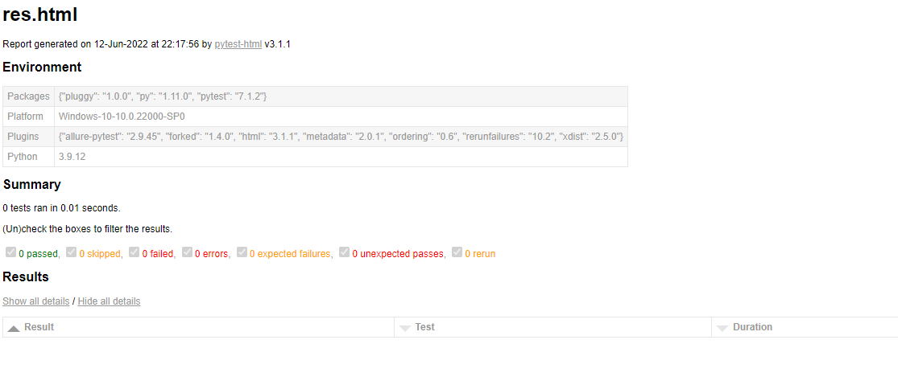

# Pytest自动化测试

## 一、pytest简介

pytest是一个非常灵活的单元测试框架，灵活和简单。其可以结合seliinum、requests，appium完成各种不同的自动化，还可以生成自定义allure报告和Jenkins持续集成。

pytest有很多强大插件，一般可以一起附带安装： requirements写入

```python
pytest
pytest-html
pytest-xdist
pytest-ordering
pytest-rerunfailures
allure-pytest
```


## 1. 插件解释：

pytest-html  生成html报告

pytest-xdist  多线程运行

pytest-ordering  自定义用例执行顺序

pytest-rerunfailres  失败用例重构

allure-pytest  生成自定义allure报告

pyyaml  操作yaml文Python的PyYAML模块是Python的YAML解析器和生成器。

requests  Requests是一个基于Apache2协议开源的Python HTTP库，号称是“为人类准备的HTTP库”。


## 2. 插件安装：

```shell
pip install -r requirements.txt
```

 

## 二、YAML 简要说明：

YAML 是 "YAML Ain't a Markup Language"（YAML 不是一种标记语言）的递归缩写。在开发的这种语言时，YAML 的意思其实是："Yet Another Markup Language"（仍是一种标记语言）。

YAML 的语法和其他高级语言类似，并且可以简单表达清单、散列表，标量等数据形态。它使用空白符号缩进和大量依赖外观的特色，特别适合用来表达或编辑数据结构、各种配置文件、倾印调试内容、文件大纲（例如：许多电子邮件标题格式和YAML非常接近）。YAML 的配置文件后缀为 .yml，如：runoob.yml 。


### 1. 基本语法

- 大小写敏感
- 使用缩进表示层级关系
- 缩进不允许使用tab，只允许空格
- 缩进的空格数不重要，只要相同层级的元素左对齐即可
- '#'表示注释


### 2. 数据类

YAML 支持以下几种数据类型：

对象：键值对的集合，又称为映射（mapping）/ 哈希（hashes） / 字典（dictionary）

数组：一组按次序排列的值，又称为序列（sequence） / 列表（list）

纯量（scalars）：单个的、不可再分的值


### 3. YAML 对象

对象键值对使用冒号结构表示 key: value，冒号后面要加一个空格。

也可以使用 key:{key1: value1, key2: value2, ...}。还可以使用缩进表示层级关系；

```yaml
key: 
    child-key: value
    child-key2: value2
```

 


较为复杂的对象格式，可以使用问号加一个空格代表一个复杂的 key，配合一个冒号加一个空格代表一个 value：

意思即对象的属性是一个数组 [complexkey1,complexkey2]，对应的值也是一个数组 [complexvalue1,complexvalue2]


```yaml
?  
    - complexkey1
    - complexkey2
:
    - complexvalue1
    - complexvalue2
```

 

### 4.  YAML 数组

以 - 开头的行表示构成一个数组：

```yaml
- A
- B
- C
```

 

YAML 支持多维数组，可以使用行内表示：

```
key: [value1, value2, ...]
```

 

数据结构的子成员是一个数组，则可以在该项下面缩进一个空格。

```yaml
-
 - A
 - B
 - C
```

 

一个相对复杂的例子：

```yaml
companies:
    -
        id: 1
        name: company1
        price: 200W
    -
        id: 2
        name: company2
        price: 500W
```

 

意思是 cmpanies 属性是一个数组，每一个数组元素又是由 id、name、price 三个属性构成。

数组也可以使用流式(flow)的方式表示：

```
companies: [{id: 1,name: company1,price: 200W},{id: 2,name: company2,price: 500W}]
```

 

### 5. 复合结构

数组和对象可以构成复合结构，例：

```yaml
languages:
  - Ruby
  - Perl
  - Python 
websites:
  YAML: yaml.org 
  Ruby: ruby-lang.org 
  Python: python.org 
  Perl: use.perl.org
```

 

转换为 json 为：

```yaml
{ 
  languages: [ 'Ruby', 'Perl', 'Python'],
  websites: {
    YAML: 'yaml.org',
    Ruby: 'ruby-lang.org',
    Python: 'python.org',
    Perl: 'use.perl.org' 
  } 
}
```

 

### 6. 纯量

纯量是最基本的，不可再分的值，包括：

- 字符串
- 布尔值
- 整数
- 浮点数
- Null
- 时间
- 日期


使用一个例子来快速了解纯量的基本使用：

```yaml
boolean: 
    - TRUE  #true,True都可以
    - FALSE  #false，False都可以
float:
    - 3.14
    - 6.8523015e+5  #可以使用科学计数法
int:
    - 123
    - 0b1010_0111_0100_1010_1110    #二进制表示
null:
    nodeName: 'node'
    parent: ~  #使用~表示null
string:
    - 哈哈
    - 'Hello world'  #可以使用双引号或者单引号包裹特殊字符
    - newline
      newline2    #字符串可以拆成多行，每一行会被转化成一个空格
date:
    - 2018-02-17    #日期必须使用ISO 8601格式，即yyyy-MM-dd
datetime: 
    -  2018-02-17T15:02:31+08:00    #时间使用ISO 8601格式，时间和日期之间使用T连接，最后使用+代表时区
```

 

### 7. 引用

& 锚点和 * 别名，可以用来引用:

```yaml
defaults: &defaults
  adapter:  postgres
  host:     localhost

development:
  database: myapp_development
  <<: *defaults

test:
  database: myapp_test
  <<: *defaults
```

 

相当于:

```yaml
defaults:
  adapter:  postgres
  host:     localhost

development:
  database: myapp_development
  adapter:  postgres
  host:     localhost

test:
  database: myapp_test
  adapter:  postgres
  host:     localhost
```

 

& 用来建立锚点（defaults），<< 表示合并到当前数据，* 用来引用锚点。


下面是另一个例子:

```yaml
- &showell Steve 
- Clark 
- Brian 
- Oren 
- *showell 
```


转为 JavaScript 代码如下:

```js
[ 'Steve', 'Clark', 'Brian', 'Oren', 'Steve' ]
```

 

## 三、Pytest默认规则


```tex
1. 模块文件必须以test_开头或者_test结尾;
2. 测试类必须以Test开头，且不能存在__init__方法;
3. 测试用例必须以test_开头。
```


## 四、执行测试用例

Pycharm：ALT+ENTER 自动导包

```tex
1. 命令行运行：pytest ./xxx.py；（推荐）
参数：
    -v 详细信息
    -s 调试信息
    -n=2 多线程：-n=2 表示测试2个线程（依赖包：pytest-xdist）    --reruns=2 假设失败，重跑2次，第三次返回结果。(依赖包：pytest-rerunfailures) 
    -x 只要出现一个测试用例失败就停止测试。
    --maxfail=2 出现2个测试用例失败才停止测试。
     ./res.html --html ./res.html 当前目录下生成html报告文件，注意路径必须设置
     -k 运行名称包含指定字符的测试用例
    
2. pytest.main() 然后运行；

3. 配置全局配置文件pytest.ini文件运行；
```

 

html测试报告

 