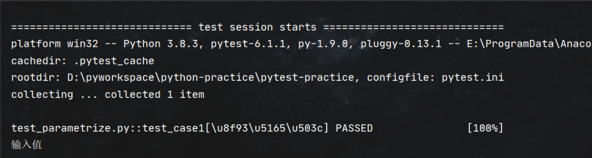

#### **一、前言**

Pytest中装饰器@pytest.mark.parametrize('参数名',list)可以实现测试用例参数化，类似DDT

#### **二、如何使用**

- 第一个参数是字符串，多个参数中间用逗号隔开
- 第二个参数是list,多组数据用元祖类型;传三个或更多参数也是这样传。list的每个元素都是一个元组，元组里的每个元素和按参数顺序一一对应
- 传一个参数 @pytest.mark.parametrize('参数名'，list) 进行参数化
- 传两个参数@pytest.mark.parametrize('参数名1，参数名2'，[(参数1_data[0], 参数2_data[0]),(参数1_data[1], 参数2_data[1])]) 进行参数化

#### **1、一个参数一个值**

示例代码如下：

```javascript
# 一个参数一个值
@pytest.mark.parametrize("input", ["输入值"])
def test_case1(input):
    print("\n" + input)
    assert input == "输入值"
```


运行结果如下图：



#### **2、一个参数多个值**

示例代码如下：

```javascript
@pytest.mark.parametrize("input", ["输入值1", "输入值2", "输入值3", "输入值4", "输入值5"])
def test_case2(input):
    print("\n" + input)
    assert '输入值' in input
```


运行结果如下:


#### **3、多参数多值**

示例代码如下：

```javascript
@pytest.mark.parametrize("userName","passWord",[("xiaoqiang","123456"),("rose","123456")("jone","123456")("Alex","123456")])
def test_login(userName,password):
    print(userName+" : "+password)
    assert userName =='rose'
```


运行结果如下：


#### **4、多个参数化的混合使用**

有点类似笛卡尔积的意思，示例代码如下：

```javascript
data1 = [1, 2]
data2 = ["python", "java"]
data3 = ["软", "件", "测", "试", "君"]


@pytest.mark.parametrize("a", data1)
@pytest.mark.parametrize("b", data2)
@pytest.mark.parametrize("c", data3)
def test_case3(a, b, c):
    print(f"生成新的数据组合为:[{a} {b} {c}]")
```


运行结果如下：


#### **5、参数化 ，传入字典数据**

示例代码如下：

```javascript
json=({"username":"alex","password":"123456"},{"username":"rongrong","password":"123456"})
@pytest.mark.parametrize('json', json)
def test_parametrize_1(json):
    print(f'字典为\n{json}')
    print(f'username : {json["username"]}, password : {json["password"]}')
```


运行结果如下：


#### **6、参数化集合标记的使用**

示例代码如下：

```javascript
@pytest.mark.parametrize("user,pwd",
                         [("xiaoqiang", "123456"), ("rose", "123456"),
                          pytest.param("jone", "123456", marks=pytest.mark.xfail),
                          pytest.param("Alex", "123456", marks=pytest.mark.skip)])
def test_login(user, pwd):
    print(user + " : " + pwd)
    assert user == "rose"
```


运行结果如下：


