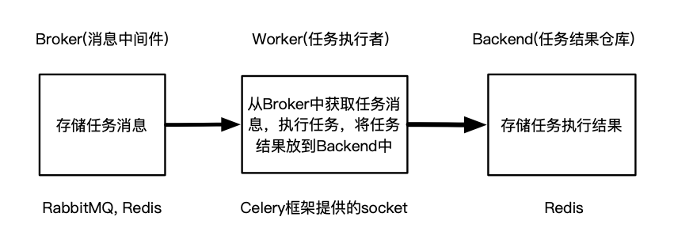
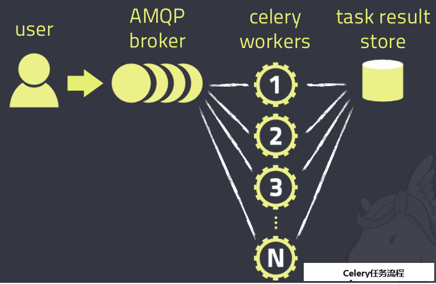

# celery学习笔记

学习链接集：

https://blog.csdn.net/chinawangfei/article/details/125441684


## 一、基本介绍

### ⭐celery：一个分布式的异步任务框架。

- 特性优势：异步任务，延迟任务，定时任务。
- 异步执行：解决耗时任务，将“耗时操作任务”提交给Celery去异步执行，比如发送短信/邮件、消息推送、音视频处理等。
- 延迟执行：解决延迟任务。
- 定时执行：解决周期(周期)任务，比如每天数据统计

```
1）可以不依赖任何服务器，通过自身命令，启动服务。
2）celery服务为其他项目服务提供“异步处理任务”的功能。
注：有两个服务同时运行，一个是项目服务，一个是celery服务。项目服务将“需要异步处理的任务”交给celery服务，celery会在需要时异步完成项目的需求。
    人是一个独立运行的服务。 
    医院也是一个独立运行的服务。
    正常情况下，人可以完成所有健康情况的动作，不需要医院的参与；但当人生病时，就会被医院接收，解决人生病问题。
    人生病的处理方案交给医院来解决，所有人不生病时，医院独立运行；人生病时，医院就来解决人生病的需求。
```


## 二、celery架构

1. 消息中间件(broker): Celery本身不提供消息服务，但是可以方便地和第三方提供的消息中间件集成，包括 Redis 等。

2. 任务执行单元(worker): Worker是Celery提供的任务执行的单元，并发运行在分布式的系统节点中(本质：一个work就是一个进程)。

3. 任务结果存储（backend）: Task result store用来存储Worker执行的任务的结果，Celery支持以不同方式存储任务的结果，包括 redis 等。

Celery异步任务框架，是一个独立运行的服务（内置socket）：

 

使用Celery框架的步骤为：

1.安装Celery框架环境，启动Celery服务（需要提前配置Broker和Backend）；

2.手动或自动添加任务到Broker中，Worker就会自动在后台异步执行任务；

3.从Backend中获取任务执行结果。

Celery具体工作流程如下图所示：

 