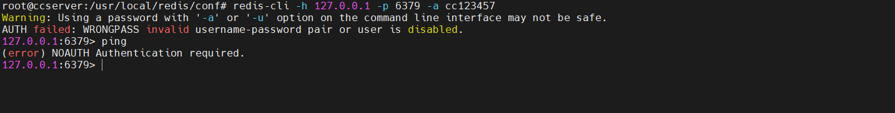

# Redis学习笔记

**学习链接:** 

http://www.yuan316.com/post/redis/


# 一、Redis是什么？

● Redis 是完全开源的、C语言实现的，遵守 BSD 协议，是一个高性能的 非关系型 key-value 数据库；

● Redis支持多种语言（c、c++、python、java、php）；

● 单线程单进程；

● Redis 与其他 key - value 缓存产品有以下三个特点：

```reStructuredText
1. Redis支持数据的持久化，可以将内存中的数据保存在磁盘中，重启的时候可以再次加载进行使用。
2. Redis不仅仅支持简单的key-value类型的数据，同时还提供list，set，zset，hash等数据结构的存储。
3. Redis支持数据的备份，即master-slave模式的数据备份。
```


# 二、Redis亮点功能	

● 持久化

支持将内存中的数据保存到磁盘中，保证数据安全，方便进行备份和恢复。

● 过期键功能

为键设置一个时间，到期自动删除 <节省内存开销>

● 事务功能

弱事务型数据库，只具备简单的事务功能。

● 主从复制

如何让Redis保持高可用的状态，官方推荐提供主从方案

● 哨兵

搭配基础的主从结构后，哨兵可做到自动故障转移

<span style="color:red">测试命令：</span>

```shell
redis-benchmark -q -n 10000  -- -q表示快速输出结果，-n表示10000个请求，还有个参数模拟客户端同时发请求默认50个
```

对比其他数据库区别：

1. mysql：关系型数据库，表格，基于磁盘，慢；
2. mangoDB：非关系型数据库，键值对文档型数据库，类似JSON文档，数据结构单一；
3. Redis诞生是为解决什么问题？ 答： 为解决硬盘IO性能的瓶颈；

● Redis应用场景

```shell
1. 缓存：做为缓存存储介质，此业务场景最为常见;查询优先走redis,没有则走mysql;可有效的降低mysql查询压力；
2. 并发计数：由于redis是单进程单线程的，可以有效解决并发请求计数场景，例如微博点赞；
3. 排行榜：各大实时排行榜，例如游戏排名、电商排名；
4. 生产者消费者模型：充当生产者消费者模型的中间层;生产者可将任务分发给redis,消费者从redis中获取任务。
```


# 三、Redis安装（linux）

##     ● 下载安装

```shell
cd /usr/local/
wget http://download.redis.io/releases/redis-7.2.5.tar.gz
tar xzf redis-7.2.5.tar.gz
cd redis-7.2.5

# centos安装命令
yum install gcc 
yum -y install centos-release-scl
yum -y install devtoolset-9-gcc devtoolset-9-gcc-c++ devtoolset-9-binutils 
scl enable devtoolset-9 bash

# 注意：scl命令启用只是临时的，退出xshell或者重启虚拟机就会恢复到原来的gcc版本。
# 如果要长期生效的话，执行如下：
echo "source /opt/rh/devtoolset-9/enable" >>/etc/profile
# 假设报错：... .../deps/lua/src/liblua.
# 解决方法：进入源码包目录下的deps目录中执行
make lua hiredis linenoise

# ubuntu安装命令
apt update
apt upgrade
apt install make gcc pkg-config
make PREFIX=/usr/local/redis install
cd /usr/local/
cp -r ./redis-7.2.5/src ./redis/
mkdir -p ./redis/conf
cp ./redis-7.2.5/redis.conf ./redis/conf/
echo -n 'export PATH=$PATH:/usr/local/redis/src' >> /etc/profile
echo -n 'export PATH=$PATH:/usr/local/redis/bin' >> /etc/profile
source /etc/profile

# 配置文件修改-远程连接配置
protected-mode no  # 关闭保护模式，允许外部访问
daemonize yes  # 后台启动
port 6379  # 设置使用端口 -- 需要放行
bind 0.0.0.0 -::1  # 注释掉bind 127.0.0.1 改为局域网内可连接 bind 0.0.0.0
requirepass cc123456  # requirepass foobared改为requirepass cc123456，cc123456为设置的密码，这个密码尽量设置复杂些。
```


 

安装完毕的配置：[https://blog.csdn.net/M_y_y/article/details/106211042](https://blog.csdn.net/M_y_y/article/details/106211042)

##     ● 测试启动服务（使用配置文件）

```
redis-server /usr/local/redis/conf/redis.conf
```

## ● 测试客户端连接

```shell
# 无密码连接
redis-cli
```

 

##     ● 安装完成之后，软件模块介绍

| <span style="color:red">模块名称</span>    | <span style="color:red">模块功能介绍</span>             |
| --------------- | -------------------------------------- |
| redis-server    | Redis服务器                            |
| redis-cli       | Redis命令行客户端                      |
| redis-benchmark | Redis性能测试                          |
| redis-check-aof | AOF文件修复工具                        |
| redis-check-rdb | RDB文件修复工具                        |
| redis-sentinel  | Sentinel服务器(2.8以后)，Redis集群使用 |

##     ● 本地客户端连接测试

```shell
# 默认端口6379，无密码：
redis-cli

# 有端口，无密码：
redis-cli -h 127.0.0.1 -p 6379

# 有端口，有密码：
redis-cli -h 127.0.0.1 -p 6379 -a cc123456

# 使用有端口有密码的方式才能正常连接

# 连接成功使用ping命令进行测试，返回PONG则成功
ping
```

有密码且密码输入错误：

 

正确连接：

 

##     ● 源码安装设置开机启动

### 方式一：配置Systemd

开机自启动redis（其他服务类似） 

CentOS7以上是用Systemd进行系统初始化的，Systemd 是 Linux 系统中最新的初始化系统（init），它主要的设计目标是克服 sysvinit 固有的缺点，提高系统的启动速度。

Systemd服务文件以.service结尾，比如现在要建立redis为开机启动，如果用yum install命令安装的，yum命令会自动创建redis.service文件，直接用命令systemcel enable redis.service设置开机启动即可。

下面为源码安装的redis-server设置开机自动启动步骤；

#### 1、配置文件路径

我编译安装的目录是：/usr/local/redis/bin ，所以配置⽂件⽬录为：/usr/local/redis/bin/redis.conf

#### 2、在系统服务目录里创建redis.service文件

```shell
vim /etc/systemd/system/redis.service

# 或（一般上面为centos的配置）

vim /lib/systemd/system/redis.service
```

#### 3、写入以下内容 (ExecStart路径为自己安装路径)

```ini
[Unit]
Description=redis-server
After=network.target

[Service]
Type=forking
ExecStart=/usr/local/redis/src/redis-server /usr/local/redis/redis.conf
PrivateTmp=true

[Install]
wantedBy=multi-user.target
```

#### 4、配置描述：

```reStructuredText
Description:描述服务
After:描述服务类别
[Service]服务运行参数的设置
Type=forking是后台运行的形式
ExecStart为服务的具体运行命令
ExecReload为重启命令
ExecStop为停止命令
PrivateTmp=True表示给服务分配独立的临时空间
注意：[Service]的启动、重启、停止命令全部要求使用绝对路径
[Install]运行级别下服务安装的相关设置，可设置为多用户，即系统运行级别为3
```

#### 5、systemctl相关命令

```shell
# 加载配置
systemctl daemon-reload
#  启动
systemctl start redis 
#  开机启动（未生效）
systemctl enable redis
# 启动redis服务
systemctl start redis.service
# 设置开机自启动
systemctl enable redis.service
# 停止开机自启动
systemctl disable redis.service
# 查看服务当前状态
systemctl status redis.service
# 重新启动服务
systemctl restart redis.service
# 查看所有已启动的服务
systemctl list-units --type=service
```

#### 6、重启服务器验证是否开机自动启动

```shell
shutdown -r now 
# 或
reboot
```

###     方式二：/etc/init.d/）-> 推荐

```shell
#  在/etc目录下新建redis目录
mkdir /etc/redis

#  复制配置文件

#  将redis.conf文件复制到/etc/redis目录
cp /usr/local/redis/redis.conf /etc/redis/

#  复制启动脚本
cp /usr/local/redis/utils/redis_init_script /etc/init.d/redis
cat /etc/init.d/redis

#  通过查看启动脚本，确定各个路径是否正确
REDISPORT=6379
EXEC=/usr/local/bin/redis-server
CLIEXEC=/usr/local/bin/redis-cli
#  改为：
REDISPORT=6399
EXEC=/usr/local/redis/src/redis-server
CLIEXEC=/usr/local/soft/redis/bin/redis-cli


# 执行自启命令
cd /etc/init.d/
chkconfig redis on

# 如果运行结果提示：service redisd does not support chkconfig，
# 解决方法： 使用vim编辑redisd文件，在第一行加入如下两行注释，保存退出，再次执行自启命令即可
# chkconfig: 2345 90 10
# description: Redis is a persistent key-value database
# 注释的意思是，redis服务必须在运行级2，3，4，5下被启动或关闭，启动的优先级是90，关闭的优先级是10。


# 启动Redis命令
service redis start


# 关闭redis命令
service redis stop
```


# 四、Python连接redis

## 1.安装python操作redis模块

```shell
pip3 install redis
```

## 2.通过python操作redis数据

```python
#!/usr/bin/env python
# -*- coding:utf-8 -*-

import redis

# 直接连接redis
conn = redis.Redis(host='10.211.55.28', port=6379, password='foobared', encoding='utf-8')

# 设置键值：15131255089="9999" 且超时时间为10秒（值写入到redis时会自动转字符串）
conn.set('15131255089', 9999, ex=10)

# 根据键获取值：如果存在获取值（获取到的是字节类型）；不存在则返回None
value = conn.get('15131255089')
print(value)
```

## 3.Redis连接池提升操作效率

上面python操作redis的示例是以直接创建连接的方式实现，每次操作redis如果都重新连接一次效率会比较低，建议使用redis连接池来替换，例如：

```python
import redis

# 创建redis连接池（默认连接池最大连接数）
pool = redis.ConnectionPool(host='10.211.55.28', port=6379, password='foobared', encoding='utf-8', max_connections=1000)

# 去连接池中获取一个连接
conn = redis.Redis(connection_pool=pool)

# 设置键值：15131255089="9999" 且超时时间为10秒（值写入到redis时会自动转字符串）
conn.set('name', "诸葛亮", ex=10)

# 根据键获取值：如果存在获取值（获取到的是字节类型）；不存在则返回None
value = conn.get('name')

print(value)
```

按理说搞定上一步python代码操作redis之后，在django中应用只需要把上面的代码写到django就可以。例如：django的视图函数中操作redis:

```shell
import redis
from django.shortcuts import HttpResponse

# 创建redis连接池
POOL = redis.ConnectionPool(host='10.211.55.28', port=6379, password='foobared', encoding='utf-8', max_connections=1000)

def index(request):

    # 去连接池中获取一个连接
    conn = redis.Redis(connection_pool=POOL)

    conn.set('name', "诸葛亮", ex=10)
    value = conn.get('name')
    print(value)
    return HttpResponse("ok")

```


# 五、Django依赖模块连接redis

上述可以实现在django中操作redis。

但是，这种形式有点非主流，因为在django中一般不这么干，而是用另一种更加简便的的方式。

## 1.安装django-redis模块（内部依赖redis模块）

```shell
pip3 install django-redis
```

## 2.在django项目的settings.py中添加相关配置

```python
... ...

CACHES = {
    "default": {
        "BACKEND": "django_redis.cache.RedisCache",
        "LOCATION": "redis://10.211.55.28:6379", # 安装redis的主机的 IP 和 端口
        "OPTIONS": {
            "CLIENT_CLASS": "django_redis.client.DefaultClient",
            "CONNECTION_POOL_KWARGS": {
                "max_connections": 1000,
                "encoding": 'utf-8'
            },
            "PASSWORD": "foobared" # redis密码
        }
    }
}

... ...

```

## 3.在django的视图中操作redis

```python
from django.shortcuts import HttpResponse
from django_redis import get_redis_connection
def index(request):
    # 去连接池中获取一个连接
    conn = get_redis_connection("default")
    conn.set('nickname', "诸葛亮", ex=10)
    value = conn.get('nickname')
    print(value)
    return HttpResponse("OK")
```


# 六、Redis其他高级用法

● http://www.yuan316.com/post/redis/

● https://www.cnblogs.com/wupeiqi/articles/5132791.html

● http://www.redis.cn/


# 七、Redis基础命令

## 1.逻辑数据库使用

默认情况，redis内置16个逻辑库（0-15），选择哪个数据库：

```shell
127.0.0.1:6379> select 0
OK
127.0.0.1:6379> set city dongguan
OK
127.0.0.1:6379> get city
"dongguan"
127.0.0.1:6379>
```

## 2.Redis服务加入开机启动脚本（ubuntu）

```shell
# 复制文件
if ! [ -f "/etc/systemd/system/rc-local.service" ];then
    cat /lib/systemd/system/rc-local.service
    cp /lib/systemd/system/rc-local.service /etc/systemd/system/rc-local.service
fi

vim /etc/systemd/system/rc-local.service

cat << EOF >> /etc/systemd/system/rc-local.service

[Install]
WantedBy=multi-user.target
EOF

systemctl daemon-reload

# 写入要运行的脚本路径
cat << EOF >> /etc/rc.local
#!/bin/bash
sh /root/RedisLen/env_start.sh
EOF
# 写入要运行的脚本内容
cat << EOF > /root/RedisLen/env_start.sh
#!/bin/bash
pgrep -f redis | xargs kill -9 >/dev/nul 2>&1
/usr/local/redis/bin/redis-server /usr/local/redis/conf/redis.conf
EOF

chmod 755 /etc/rc.local
chmod 755 /root/RedisLen/env_start.sh

systemctl start rc-local.service
# 假设报错
# Job for rc-local.service failed because the control process exited with error code.
# See "systemctl status rc-local.service" and "journalctl -xeu rc-local.service" for details.
# 解决参考文档：https://blog.csdn.net/djstavav/article/details/88166805

systemctl status rc-local.service
systemctl enable rc-local.service
```


# 八、支持数据持久化方案（RDB/AOF）

 

## ● RDB

RDB是一种快照存储持久化方式，具体就是将Redis某一时刻的内存数据保存到硬盘的文件当中，默认保存的文件名为dump.rdb，而在Redis服务器启动时，会重新加载dump.rdb文件的数据到内存当中恢复数据。

**开启RDB持久化方式：**开启RDB持久化方式很简单，客户端可以**通过向Redis服务器发送save或bgsave命令让服务器生成rdb文件**，或者**通过服务器配置文件指定触发RDB条件**。

### 1.save命令

```shell
# 同步数据到磁盘上
> save
```

**当客户端向服务器发送save命令请求进行持久化时，服务器会阻塞save命令之后的其他客户端的请求，直到数据同步完成。**

如果数据量太大，同步数据会执行很久，而这期间Redis服务器也无法接收其他请求，所以，最好不要在生产环境使用save命令。

### 2.bgsave命令

```
与save命令不同，bgsave命令是一个异步操作。
# 异步保存数据集到磁盘
> bgsave
```

当客户端发服务发出bgsave命令时，Redis服务器主进程会forks一个子进程来数据同步问题，在将数据保存到rdb文件之后，子进程会退出。

所以，与save命令相比，Redis服务器在处理bgsave采用子线程进行IO写入，而主进程仍然可以接收其他请求，但forks子进程是同步的，所以forks子进程时，一样不能接收其他请求，这意味着，如果forks一个子进程花费的时间太久(一般是很快的)，bgsave命令仍然有阻塞其他客户的请求的情况发生。

### 3. 服务器配置自动触发

除了通过客户端发送命令外，还有一种方式，就是在Redis配置文件中的save指定到达触发RDB持久化的条件，比如【多少秒内至少达到多少写操作】就开启RDB数据同步。

配置文件redis.conf指定如下的选项：

```
# 启动服务器加载配置文件 
vim /usr/local/redis/conf/redis.conf
```

```ini
# 900s内至少达到一条写命令
save 900 1
# 300s内至少达至10条写命令
save 300 10
# 60s内至少达到10000条写命令
save 60 10000
```

```
# 启动服务器加载配置文件 
redis-server /usr/local/redis/conf/redis.conf
```

这种通过服务器配置文件触发RDB的方式，与bgsave命令类似，达到触发条件时，会forks一个子进程进行数据同步，不过最好不要通过这方式来触发RDB持久化，因为设置触发的时间太短，则容易频繁写入rdb文件，影响服务器性能，时间设置太长则会造成数据丢失。

### 4.rdb文件

前面介绍了三种让服务器生成rdb文件的方式，无论是由主进程生成还是子进程来生成，其过程如下：

- 生成临时rdb文件，并写入数据。
- 完成数据写入，用临时文代替代正式rdb文件。
- 删除原来的db文件。

RDB默认生成的文件名为dump.rdb，当然，我可以通过配置文件进行更加详细配置，比如在单机下启动多个redis服务器进程时，可以通过端口号配置不同的rdb名称，如下所示：

```bash
# 是否压缩rdb文件
rdbcompression yes

# rdb文件的名称
dbfilename redis-6379.rdb

# rdb文件保存目录
dir ~/redis/
```

**RDB的几个优点**

- 与AOF方式相比，通过rdb文件恢复数据比较快。
- rdb文件非常紧凑，适合于数据备份。
- 通过RDB进行数据备，由于使用子进程生成，所以对Redis服务器性能影响较小。

**RDB的几个缺点**

- 如果服务器宕机的话，采用RDB的方式会造成某个时段内数据的丢失，比如我们设置10分钟同步一次或5分钟达到1000次写入就同步一次，那么如果还没达到触发条件服务器就死机了，那么这个时间段的数据会丢失。
- 使用save命令会造成服务器阻塞，直接数据同步完成才能接收后续请求。
- 使用bgsave命令在forks子进程时，如果数据量太大，forks的过程也会发生阻塞，另外，forks子进程会耗费内存。


## ● AOF

与RDB存储某个时刻的快照不同，AOF持久化方式会记录客户端对服务器的每一次写操作命令，并将这些写操作以Redis协议追加保存到以后缀为aof文件末尾，在Redis服务器重启时，会加载并运行aof文件的命令，以达到恢复数据的目的。

**开启AOF持久化方式**

Redis默认不开启AOF持久化方式，我们可以在配置文件中开启并进行更加详细的配置，如下面的redis.conf文件：

```bash
# 开启aof机制
appendonly yes

# aof文件名
appendfilename "appendonly.aof"

# 写入策略,always表示每个写操作都保存到aof文件中,也可以是everysec或no
appendfsync always

# 默认不重写aof文件
no-appendfsync-on-rewrite no

# 保存目录
dir ~/redis/
```

### 1.三种写入策略

在上面的配置文件中，我们可以通过appendfsync选项指定写入策略,有三个选项

```bash
appendfsync always
# appendfsync everysec
# appendfsync no
```

#### 1.1 always

客户端的每一个写操作都保存到aof文件当，这种策略很安全，但是每个写请注都有IO操作，所以也很慢。

#### 1.2 everysec

appendfsync的默认写入策略，每秒写入一次aof文件，因此，最多可能会丢失1s的数据。

#### 1.3 no

Redis服务器不负责写入aof，而是交由操作系统来处理什么时候写入aof文件。更快，但也是最不安全的选择，不推荐使用。

### 2.AOF文件重写

AOF将客户端的每一个写操作都追加到aof文件末尾，比如对一个key多次执行incr命令，这时候，aof保存每一次命令到aof文件中，aof文件会变得非常大。

```dart
incr num 1
incr num 2
incr num 3
incr num 4
incr num 5
incr num 6
...
incr num 100000
```

aof文件太大，加载aof文件恢复数据时，就会非常慢，为了解决这个问题，Redis支持aof文件重写，通过重写aof，可以生成一个恢复当前数据的最少命令集，比如上面的例子中那么多条命令，可以重写为：

```sql
set num 100000
```

aof文件是一个二进制文件，并不是像上面的例子一样，直接保存每个命令，而使用Redis自己的格式，上面只是方便演示。

### 3.两种重写方式

通过在redis.conf配置文件中的选项no-appendfsync-on-rewrite可以设置是否开启重写，这种方式会在每次fsync时都重写，影响服务器性以，因此默认值为no，不推荐使用。

```perl
# 默认不重写aof文件
no-appendfsync-on-rewrite no
```

客户端向服务器发送bgrewriteaof命令，也可以让服务器进行AOF重写。

```bash
# 让服务器异步重写追加aof文件命令
> bgrewriteaof
```

AOF重写方式也是异步操作，即如果要写入aof文件，则Redis主进程会forks一个子进程来处理。

重写aof文件的好处

- 压缩aof文件，减少磁盘占用量。
- 将aof的命令压缩为最小命令集，加快了数据恢复的速度。

### 4.AOF文件损坏

在写入aof日志文件时，如果Redis服务器宕机，则aof日志文件文件会出格式错误，在重启Redis服务器时，Redis服务器会拒绝载入这个aof文件，可以通过以下步骤修复aof并恢复数据。

1、备份现在aof文件，以防万一。

2、使用redis-check-aof命令修复aof文件，该命令格式如下：

```php
# 修复aof日志文件
$ redis-check-aof -fix file.aof
```

3、重启Redis服务器，加载已经修复的aof文件，恢复数据。

### 5.AOF的优点

- AOF只是追加日志文件，因此对服务器性能影响较小，速度比RDB要快，消耗的内存较少。

### 6.AOF的缺点

- AOF方式生成的日志文件太大，即使通过AFO重写，文件体积仍然很大。
- 恢复数据的速度比RDB慢


## ● 选择RDB还是AOF呢？

通过上面的介绍，我们了解了RDB与AOF各自的优点与缺点，到底要如何选择呢？

通过下面的表示，我们可以从几个方面对比一下RDB与AOF：

​		在应用时，要根本自己的实际需求，选择RDB或者AOF，其实，如果想要数据足够安全，**可以两种方式都开启，但两种持久化方式同时进行IO操作，会严重影响服务器性能**，因此有时候不得不做出选择。

**当RDB与AOF两种方式都开启时，Redis会优先使用AOF日志来恢复数据，因为AOF保存的文件比RDB文件更完整。**


## ● RDB/AOF小结 

Redis的持久化机制的知识，其实，如果你只是单纯把Redis作为缓存服务器，那么可以完全不用考虑持久化；

但是，在如今的大多数服务器架构中，Redis只是扮演一个缓存服务器的角色，还可以作为数据库，保存我们的业务数据，此时，我们则需要好好了解有关Redis持久化策略的区别与选择。


# 九、Redis配置参数

参考链接：https://blog.csdn.net/admans/article/details/101981770

| 序号                                                         | 配置项                           | 说明                                                         |
| ------------------------------------------------------------ | -------------------------------- | ------------------------------------------------------------ |
| 1                                                            | daemonize no                     | Redis  默认不是以守护进程的方式运行，可以通过该配置项修改，使用 yes 启用守护进程（Windows 不支持守护线程的配置为 no ） |
| 2                                                            | pidfile  /var/run/redis.pid      | 当 Redis  以守护进程方式运行时，Redis 默认会把 pid 写入 /var/run/redis.pid 文件，可以通过 pidfile 指定 |
| 3                                                            | port 6379                        | 指定 Redis 监听端口，默认端口为  6379，作者在自己的一篇博文中解释了为什么选用 6379 作为默认端口，因为 6379 在手机按键上 MERZ 对应的号码，而 MERZ 取自意大利歌女  Alessia Merz 的名字 |
| 4                                                            | bind 127.0.0.1                   | 绑定的主机地址                                               |
| 5                                                            | timeout 300                      | 当客户端闲置多长时间后关闭连接，如果指定为  0，表示关闭该功能 |
| 6                                                            | loglevel notice                  | 指定日志记录级别，Redis  总共支持四个级别：debug、verbose、notice、warning，默认为 notice |
| 7                                                            | logfile stdout                   | 日志记录方式，默认为标准输出，如果配置  Redis 为守护进程方式运行，而这里又配置为日志记录方式为标准输出，则日志将会发送给 /dev/null |
| 8                                                            | databases 16                     | 设置数据库的数量，默认数据库为0，可以使用SELECT  命令在连接上指定数据库id |
| 9                                                            | save <seconds>  <changes>        | 指定在多长时间内，有多少次更新操作，就将数据同步到数据文件，可以多个条件配合 |
| Redis  默认配置文件中提供了三个条件：                        |                                  |                                                              |
| save 900 1                                                   |                                  |                                                              |
| save 300 10                                                  |                                  |                                                              |
| save 60 10000                                                |                                  |                                                              |
| 分别表示 900 秒（15  分钟）内有 1 个更改，300 秒（5 分钟）内有 10 个更改以及 60 秒内有 10000 个更改。 |                                  |                                                              |
| 10                                                           | rdbcompression yes               | 指定存储至本地数据库时是否压缩数据，默认为  yes，Redis 采用 LZF 压缩，如果为了节省 CPU 时间，可以关闭该选项，但会导致数据库文件变的巨大 |
| 11                                                           | dbfilename dump.rdb              | 指定本地数据库文件名，默认值为  dump.rdb                     |
| 12                                                           | dir ./                           | 指定本地数据库存放目录                                       |
| 13                                                           | slaveof  <masterip> <masterport> | 设置当本机为 slav 服务时，设置  master 服务的 IP 地址及端口，在 Redis 启动时，它会自动从 master 进行数据同步 |
| 14                                                           | masterauth  <master-password>    | 当 master  服务设置了密码保护时，slav 服务连接 master 的密码 |
| 15                                                           | requirepass foobared             | 设置 Redis  连接密码，如果配置了连接密码，客户端在连接 Redis 时需要通过 AUTH <password> 命令提供密码，默认关闭 |
| 16                                                           | maxclients 128                   | 设置同一时间最大客户端连接数，默认无限制，Redis  可以同时打开的客户端连接数为 Redis 进程可以打开的最大文件描述符数，如果设置 maxclients  0，表示不作限制。当客户端连接数到达限制时，Redis 会关闭新的连接并向客户端返回 max number of clients reached 错误信息 |
| 17                                                           | maxmemory  <bytes>               | 指定 Redis 最大内存限制，Redis  在启动时会把数据加载到内存中，达到最大内存后，Redis 会先尝试清除已到期或即将到期的 Key，当此方法处理  后，仍然到达最大内存设置，将无法再进行写入操作，但仍然可以进行读取操作。Redis 新的 vm 机制，会把 Key 存放内存，Value 会存放在  swap 区 |
| 18                                                           | appendonly no                    | 指定是否在每次更新操作后进行日志记录，Redis  在默认情况下是异步的把数据写入磁盘，如果不开启，可能会在断电时导致一段时间内的数据丢失。因为 redis 本身同步数据文件是按上面 save  条件来同步的，所以有的数据会在一段时间内只存在于内存中。默认为 no |
| 19                                                           | appendfilename  appendonly.aof   | 指定更新日志文件名，默认为  appendonly.aof                   |
| 20                                                           | appendfsync everysec             | 指定更新日志条件，共有 3 个可选值：                          |
|                                                              |                                  |                                                              |
| no：表示等操作系统进行数据缓存同步到磁盘（快）               |                                  |                                                              |
|                                                              |                                  |                                                              |
| always：表示每次更新操作后手动调用  fsync() 将数据写到磁盘（慢，安全） |                                  |                                                              |
|                                                              |                                  |                                                              |
| everysec：表示每秒同步一次（折中，默认值）                   |                                  |                                                              |
|                                                              |                                  |                                                              |
| 21                                                           | vm-enabled no                    | 指定是否启用虚拟内存机制，默认值为  no，简单的介绍一下，VM 机制将数据分页存放，由 Redis 将访问量较少的页即冷数据 swap  到磁盘上，访问多的页面由磁盘自动换出到内存中（在后面的文章我会仔细分析 Redis 的 VM 机制） |
| 22                                                           | vm-swap-file  /tmp/redis.swap    | 虚拟内存文件路径，默认值为  /tmp/redis.swap，不可多个 Redis 实例共享 |
| 23                                                           | vm-max-memory 0                  | 将所有大于 vm-max-memory  的数据存入虚拟内存，无论 vm-max-memory 设置多小，所有索引数据都是内存存储的(Redis 的索引数据 就是 keys)，也就是说，当  vm-max-memory 设置为 0 的时候，其实是所有 value 都存在于磁盘。默认值为 0 |
| 24                                                           | vm-page-size 32                  | Redis swap 文件分成了很多的  page，一个对象可以保存在多个 page 上面，但一个 page 上不能被多个对象共享，vm-page-size 是要根据存储的  数据大小来设定的，作者建议如果存储很多小对象，page 大小最好设置为 32 或者 64bytes；如果存储很大大对象，则可以使用更大的  page，如果不确定，就使用默认值 |
| 25                                                           | vm-pages 134217728               | 设置 swap 文件中的 page  数量，由于页表（一种表示页面空闲或使用的 bitmap）是在放在内存中的，，在磁盘上每 8 个 pages 将消耗 1byte 的内存。 |
| 26                                                           | vm-max-threads 4                 | 设置访问swap文件的线程数,最好不要超过机器的核数,如果设置为0,那么所有对swap文件的操作都是串行的，可能会造成比较长时间的延迟。默认值为4 |
| 27                                                           | glueoutputbuf yes                | 设置在向客户端应答时，是否把较小的包合并为一个包发送，默认为开启 |
| 28                                                           | hash-max-zipmap-entries  64      | 指定在超过一定的数量或者最大的元素超过某一临界值时，采用一种特殊的哈希算法 |
| hash-max-zipmap-value  512                                   |                                  |                                                              |
| 29                                                           | activerehashing yes              | 指定是否激活重置哈希，默认为开启（后面在介绍  Redis 的哈希算法时具体介绍） |
| 30                                                           | include  /path/to/local.conf     | 指定包含其它的配置文件，可以在同一主机上多个Redis实例之间使用同一份配置文件，而同时各个实例又拥有各自独立的配置 |