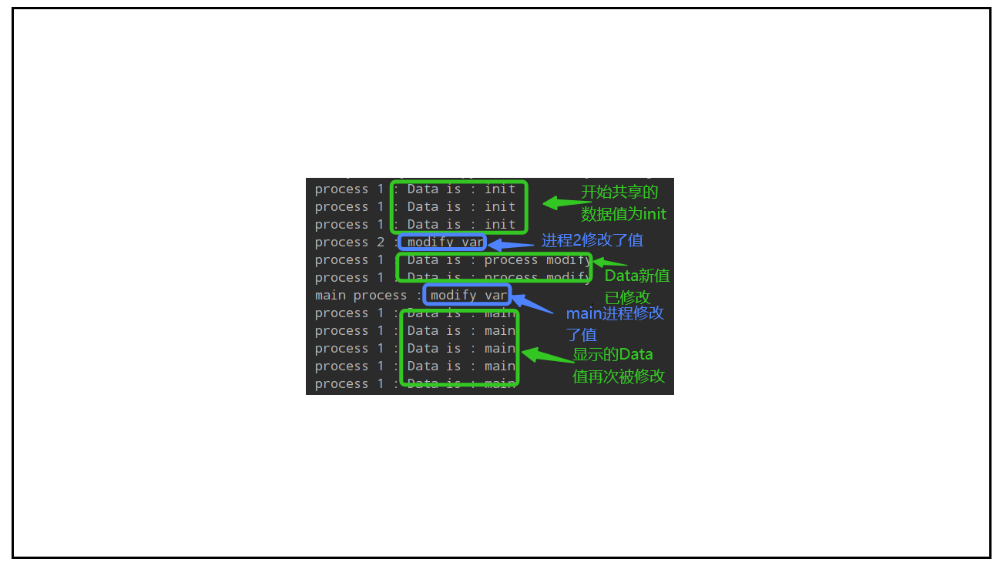

## 多进程共享变量

## 一、共享变量类：multiprocess.Value

​	学习链接：https://www.cnblogs.com/junyuhuang/p/5539599.html

​	测试案例

```python
# 多进程共享变量
# 类型创建参考：https://www.cnblogs.com/junyuhuang/p/5539599.html

import multiprocessing
from ctypes import c_bool

REPORT_EXECUTOR_END_TF = multiprocessing.Value(c_bool, False)  # 这是一个对象，获取值：REPORT_EXECUTOR_END_TF.value

# 子进程，内部修改REPORT_EXECUTOR_END_TF.value主进程同样发生改变
ttt_process = multiprocessing.Process(target=runner.run_task, args=(REPORT_EXECUTOR_END_TF,))
ttt_process.name = "ttt"
ttt_process.daemon = True
ttt_process.start()
```

## 二、共享自定义类实例或者包：multiprocess.pool

​		使用multiprocessing.Manager来创建一个共享的命名空间，该命名空间可用于存储需要共享的对象。可以使用Manager()方法来创建一个新的管理器实例，然后使用Namespace()方法创建一个新的命名空间。将需要共享的对象传递给工作进程池中的函数。这些函数可以从共享命名空间中获取对象，对其进行更改，并将更改后的对象写回共享命名空间中。
​		如果需要在工作进程池中使用自定义类实例，则需要确保该类可序列化。可以通过实现`__getstate__()`和`__setstate__()`方法来完成这一点，以便序列化和反序列化对象。另外，还需要在每个工作进程池中导入该类的定义，以便使用该类，示例代码：

```python
import multiprocessing as mp
from multiprocessing import Manager
import my_module

# 定义自定义类
class MyClass:
    def __init__(self):
        self.value = 0
        
    def increment(self):
        self.value += 1

# 定义工作进程池中的函数
def worker_func(shared_namespace):
    # 从共享命名空间中获取对象
    my_object = shared_namespace.my_object
    
    # 使用自定义类实例
    my_object.increment()
    
    # 使用共享的包
    my_module.my_function()
    
    # 将更改后的对象写回共享命名空间中
    shared_namespace.my_object = my_object

if __name__ == '__main__':
    # 创建共享命名空间
    manager = Manager()
    shared_namespace = manager.Namespace()
    
    # 创建自定义类实例并添加到共享命名空间中
    my_object = MyClass()
    shared_namespace.my_object = my_object
    
    # 创建工作进程池并执行工作函数
    with mp.Pool(processes=4) as pool:
        pool.map(worker_func, [shared_namespace]*4)
    
    # 从共享命名空间中获取更改后的对象
    my_object = shared_namespace.my_object
    print(my_object.value)
```

​		在上面的示例中，我们首先创建了一个自定义类`MyClass`，该类具有一个`increment`方法，用于增加类的`value`属性的值。然后，我们使用`multiprocessing.Manager`创建了一个共享命名空间，并将`MyClass`实例添加到其中。接下来，我们使用工作进程池中的函数`worker_func`来获取共享命名空间中的`MyClass`实例，并使用其`increment`方法进行更改。我们还使用共享的包`my_module`中的函数`my_function`。

​		最后，我们从共享命名空间中获取更改后的对象，并输出其`value`属性的值。注意，由于`MyClass`不是原生可序列化的，因此我们需要注意，由于`MyClass`不是原生可序列化的，因此我们需要在该类中实现`__getstate__()`和`__setstate__()`方法，以便可以将其序列化和反序列化。具体来说，`__getstate__()`方法应该返回一个包含`MyClass`实例的字典，而`__setstate__()`方法应该从字典中恢复`MyClass`实例。以下是`MyClass`的修改版本：

```python
# 定义自定义类
class MyClass:
    def __init__(self):
        self.value = 0
        
    def increment(self):
        self.value += 1
    
    def __getstate__(self):
        return {'value': self.value}
    
    def __setstate__(self, state):
        self.value = state['value']
```

​		在实现`__getstate__()`和`__setstate__()`方法后，我们可以将`MyClass`实例添加到共享命名空间中，然后在工作进程池中使用该实例，如下所示：

```python
if __name__ == '__main__':
    # 创建共享命名空间
    manager = Manager()
    shared_namespace = manager.Namespace()
    
    # 创建自定义类实例并添加到共享命名空间中
    my_object = MyClass()
    shared_namespace.my_object = my_object
    
    # 创建工作进程池并执行工作函数
    with mp.Pool(processes=4) as pool:
        pool.map(worker_func, [shared_namespace]*4)
    
    # 从共享命名空间中获取更改后的对象
    my_object = shared_namespace.my_object
    print(my_object.value)
```

​		在上面的示例中，我们将`MyClass`实例`my_object`添加到共享命名空间中，并将共享命名空间传递给工作进程池中的函数`worker_func`。在`worker_func`中，我们可以从共享命名空间中获取`my_object`，然后使用其`increment`方法进行更改，并将更改后的对象写回共享命名空间中。最后，我们从共享命名空间中获取更改后的对象，并输出其`value`属性的值。

​		总的来说，共享自定义类实例或包时，需要将它们存储在共享的命名空间中，并在工作进程池中使用共享的命名空间来获取和更改这些对象。如果需要在工作进程池中使用自定义类实例，则需要确保该类可序列化，并实现`__getstate__()`和`__setstate__()`方法。

​		除了使用`multiprocessing.Manager`来创建共享命名空间外，还可以使用`multiprocessing.Manager().Value`和`multiprocessing.Manager().Array`方法创建共享值和数组。如果要共享自定义类实例，可以将其存储在共享数组或值中。这样做的好处是，可以将多个进程之间共享的数据存储在一个位置，而不是在多个位置。这可以减少内存使用和数据传输开销。

​		以下是一个示例代码，演示如何在使用`multiprocessing.pool`中共享自定义类实例和包：

```python
import multiprocessing as mp
from multiprocessing import Manager
import my_module

# 定义自定义类
class MyClass:
    def __init__(self):
        self.value = 0
        
    def increment(self):
        self.value += 1

# 定义工作进程池中的函数
def worker_func(shared_value, shared_array):
    # 获取共享的值
    value = shared_value.value
    
    # 获取共享的数组
    my_array = shared_array[:]
    
    # 获取共享的自定义类实例
    my_object = MyClass()
    my_object.__dict__.update(shared_array[0].__dict__)
    
    # 使用自定义类实例
    my_object.increment()
    
    # 使用共享的包
    my_module.my_function()
    
    # 将更改后的对象写回共享数组中
    my_array[0] = my_object
    
    # 将更改后的值写回共享值中
    shared_value.value = value + 1
    
    # 将更改后的数组写回共享数组中
    shared_array[:] = my_array

if __name__ == '__main__':
    # 创建共享值和数组
    manager = Manager()
    shared_value = manager.Value('i', 0)
    shared_array = manager.Array('d', [MyClass()])
    
    # 创建工作进程池并执行工作函数
    with mp.Pool(processes=4) as pool:
        pool.map(worker_func, [shared_value]*4, [shared_array]*4)
    
    # 从共享数组中获取更改后的对象
    my_object = shared_array[0]
    print(my_object.value)
    
    # 从共享值中获取更改后的值
    value = shared_value.value
    print(value)
```

​		在上面的示例中，我们首先使用`multiprocessing.Manager().Value`和`multiprocessing.Manager().Array`方法创建了共享值和数组。接下来，我们在工作进程池中的函数`worker_func`中获取共享的值、数组和自定义类实例。我们使用自定义类实例`MyClass`的`increment`方法进行更改，并使用共享的包`my_module`中的函数`my_function`。最后，我们将更改后的对象、值和数组写回共享对象中。注意，在共享自定义类实例时，我们使用了`my_object.__dict__.update(shared_array[0].__dict__)`将共享数组中存储的对象的属性值复制到新的对象中。这样可以确保新的对象具有相同的属性值，而不需要重新实例化对象。

​		在完成工作进程池中的任务后，我们可以从共享数组中获取更改后的对象，并输出其`value`属性的值。同样，我们可以从共享值中获取更改后的值，并输出其值。

​		总的来说，使用共享值、数组和命名空间是在使用`multiprocessing.pool`时共享数据的有效方式。这些方法允许多个进程之间共享数据，并减少了内存使用和数据传输的开销。当使用自定义类实例时，需要注意实现`__getstate__()`和`__setstate__()`方法，并将其存储在共享数组中。当使用共享包时，需要在每个工作进程池中导入该包的定义。

## 三、multiprocessing第三方包BaseManager/Manager类

学习链接：https://blog.gcoperation.top/posts/1852aeac/

通过manager.register进行注册类，注册完后，对各个进程传入类的实例

```python
import multiprocessing
from multiprocessing.managers import BaseManager
import threading
import time

# 锁可以通过global也可以在Process中传无所谓
share_lock = threading.Lock()


# 定义一个要共享实例化对象的类
class Test():
    def __init__(self):
        self.test_data = "init"

    def print_test_list(self, process_name):
        while True:
            print(f"{process_name} : Data is : {self.test_data}")
            time.sleep(2)

    def set_test_list(self, process_name, data):
        print(f"{process_name} : modify var")
        self.test_data = data


# 查看共享的类成员当前的值
def view_var(process_name, obj):
    obj.print_test_list(f"{process_name}")


# 模拟一个进程修改共享的类对象
def modify_var(process_name, obj):
    obj.set_test_list(process_name, "process modify")


# 主进程
def main_process():
    # 如果是想注册open方法这样操作
    # manager = BaseManager()
    # # 一定要在start前注册，不然就注册无效
    # manager.register('open', open)
    # manager.start()
    # obj = manager.open("1.txt","a")

    # 为了更加直接我们直接以一个Test类的实例化对象来演示
    manager = BaseManager()
    # 一定要在start前注册，不然就注册无效
    manager.register('Test', Test)  # 第一个参数为类型id，通常和第二个参数传入的类的类名相同，直观并且便于阅读
    manager.start()
    obj = manager.Test()

    process_list = []
    # 创建进程1，用于不断显示共享类对象的成员变量值
    process_name = "process 1"
    tmp_process = multiprocessing.Process(target=view_var, args=(process_name, obj))
    process_list.append(tmp_process)
    # 创建进程2， 用于模拟一个进程修改类对象
    process_name = "process 2"
    tmp_process = multiprocessing.Process(target=modify_var, args=(process_name, obj))
    process_list.append(tmp_process)
    # 启动所有进程
    for process in process_list:
        process.start()
        time.sleep(5)  # 此处第一个进程start后等待5s是为了演示当前类成员变量的值。第二次循环再等待5s是为了演示子进程修改类成员变量值。

    obj.set_test_list("main process", "main")  # 此处演示主进程修改共享的类对象成员变量的值。
    time.sleep(5)  # 等待5s用于给view_var方法打印的时间

    for process in process_list:
        process.join()


if __name__ == "__main__":
    main_process()
```

 