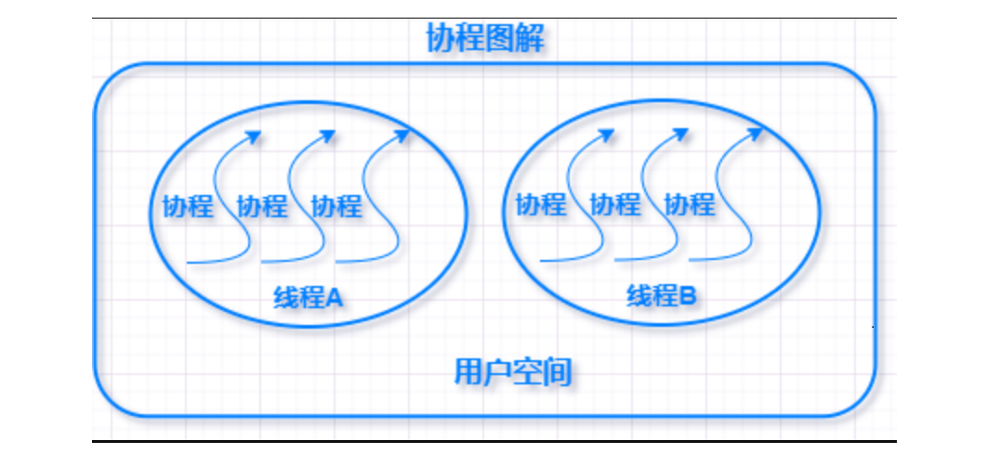

# 并发编程研习

python并发编程是为了更快的运行程序，充分利用机器资源。

**并发与并行**

**并发：**在操作系统中，某一时间段，几个程序在同一个CPU上运行，但在任意一个时间点上，只有一个程序在CPU上运行。
当有多个线程时，如果系统只有一个CPU，那么CPU不可能真正同时进行多个线程，CPU的运行时间会被划分成若干个时间段，每个时间段分配给各个线程去执行，一个时间段里某个线程运行时，其他线程处于挂起状态，这就是并发。并发解决了程序排队等待的问题，如果一个程序发生阻塞，其他程序仍然可以正常执行。

**并行：**当操作系统有多个CPU时，一个CPU处理A线程，另一个CPU处理B线程，两个线程互相不抢占CPU资源，可以同时进行，这种方式成为并行。

**两者区别：**

1. 并发只是在宏观上给人感觉有多个程序在同时运行，但在实际的单CPU系统中，每一时刻只有一个程序在运行，微观上这些程序是分时交替执行。
2. 在多CPU系统中，将这些并发执行的程序分配到不同的CPU上处理，每个CPU用来处理一个程序，这样多个程序便可以实现同时执行。

**并发编程：**

```shell
# 进程：
	一个进程好比是一个程序，它是 资源分配的最小单位 。
	同一时刻执行的进程数不会超过核心数。不过如果问单核CPU能否运行多进程？答案又是肯定的。单核CPU也可以运行多进程，只不过不是同时的，而是极快地在进程间来回切换实现的多进程。举个简单的例子，就算是十年前的单核CPU的电脑，也可以聊QQ的同时看视频。

# 线程
	如果说进程和进程之间相当于程序与程序之间的关系，那么线程与线程之间就相当于程序内的任务和任务之间的关系。
	所以线程是依赖于进程的，也称为 「微进程」 。它是 程序执行过程中的最小单元。

# 进程与线程的区别
	进程是CPU资源分配的基本单位，线程是独立运行和独立调度的基本单位（CPU上真正运行的是线程）。
	进程拥有自己的资源空间，一个进程包含若干个线程，线程与CPU资源分配无关，多个线程共享同一进程内的资源。
	线程的调度与切换比进程快很多。
	CPU密集型代码(各种循环处理、计算等等)：使用多进程。IO密集型代码(文件处理、网络爬虫等)：使用多线程

# 阻塞与非阻塞
	阻塞是指调用线程或者进程被操作系统挂起。
	非阻塞是指调用线程或者进程不会被操作系统挂起。

# 同步与异步
	同步是阻塞模式，异步是非阻塞模式。
	同步就是指一个进程在执行某个请求的时候，若该请求需要一段时间才能返回信息，那么这个进程将会一直等待下去，直到收到返回信息才继续执行下去；
	
	异步是指进程不需要一直等下去，而是继续执行下面的操作，不管其他进程的状态。当有消息返回式系统会通知进程进行处理，这样可以提高执行的效率。
	由调用方盲目主动问询的方式是同步调用，由被调用方主动通知调用方任务已完成的方式是异步调用。

# 协程
	协程，又称微线程，纤程。英文名Coroutine。协程是一种用户态的轻量级线程。
	协程拥有自己的寄存器上下文和栈。协程调度切换时，将寄存器上下文和栈保存到其他地方，在切回来的时候，恢复先前保存的寄存器上下文和栈。因此：
	协程能保留上一次调用时的状态（即所有局部状态的一个特定组合），每次过程重入时，就相当于进入上一次调用的状态，换种说法：进入上一次离开时所处逻辑流的位置。

	协程的好处：
	1.无需线程上下文切换的开销
	2.无需原子操作锁定及同步的开销
	3.方便切换控制流，简化编程模型
	4.高并发+高扩展性+低成本：一个CPU支持上万的协程都不是问题。所以很适合用于高并发处理。
	
	缺点：
	1.无法利用多核资源：协程的本质是个单线程,它不能同时将 单个CPU 的多个核用上,协程需要和进程配合才能运行在多CPU上.当然我们日常所编写的绝大部分应用都没有这个必要，除非是cpu密集型应用。
	2.进行阻塞（Blocking）操作（如IO时）会阻塞掉整个程序
	
# CPU密集型（CPU-bound）
	CPU密集型也叫计算密集型，指的是系统的硬盘、内存性能相对CPU要好很多，此时，系统运作大部分的状况是CPU Loading 100%，CPU要读/写I/O(硬盘/内存)，I/O在很短的时间就可以完成，而CPU还有许多运算要处理，CPU Loading很高。
	在多重程序系统中，大部份时间用来做计算、逻辑判断等CPU动作的程序称之CPU bound。例如一个计算圆周率至小数点一千位以下的程序，在执行的过程当中绝大部份时间用在三角函数和开根号的计算，便是属于CPU bound的程序。
	CPU bound的程序一般而言CPU占用率相当高。这可能是因为任务本身不太需要访问I/O设备，也可能是因为程序是多线程实现因此屏蔽掉了等待I/O的时间。

# IO密集型（I/O bound）
	IO密集型指的是系统的CPU性能相对硬盘、内存要好很多，此时，系统运作，大部分的状况是CPU在等I/O (硬盘/内存) 的读/写操作，此时CPU Loading并不高。
	I/O bound的程序一般在达到性能极限时，CPU占用率仍然较低。这可能是因为任务本身需要大量I/O操作，而pipeline做得不是很好，没有充分利用处理器能力。

```

 

  